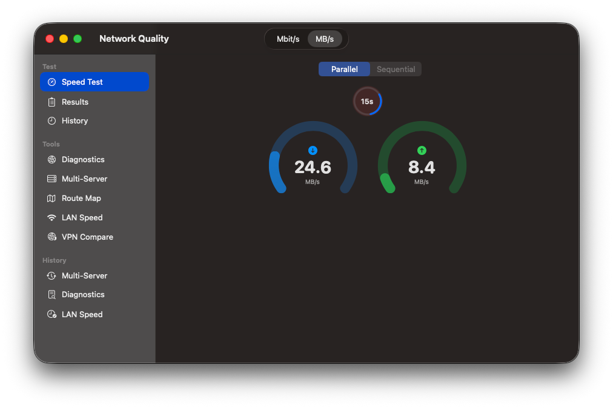
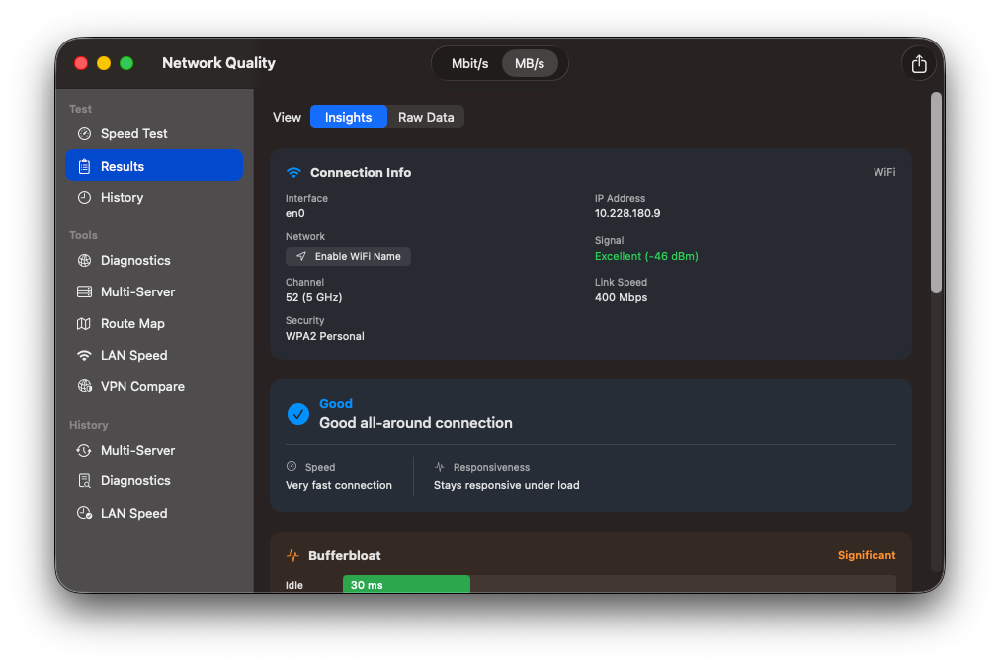
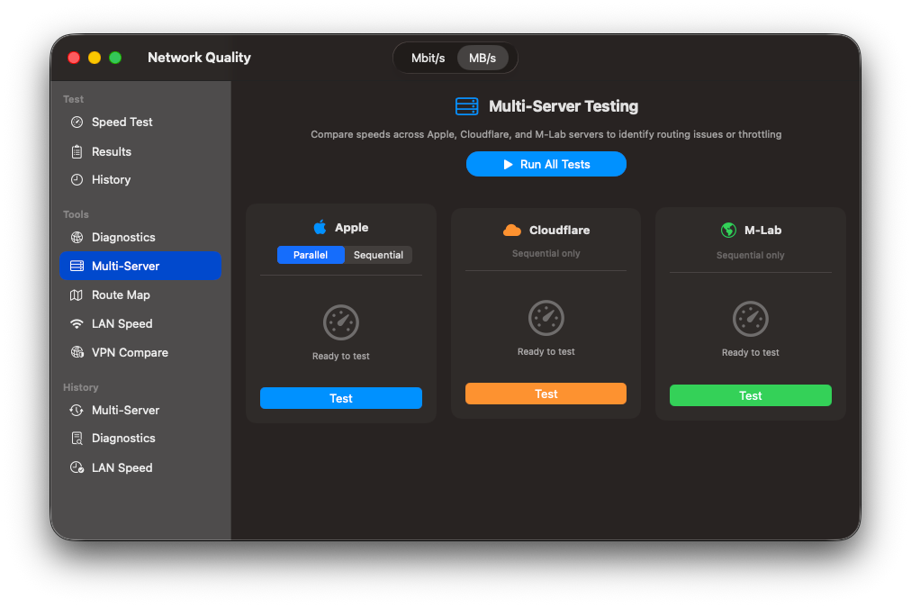
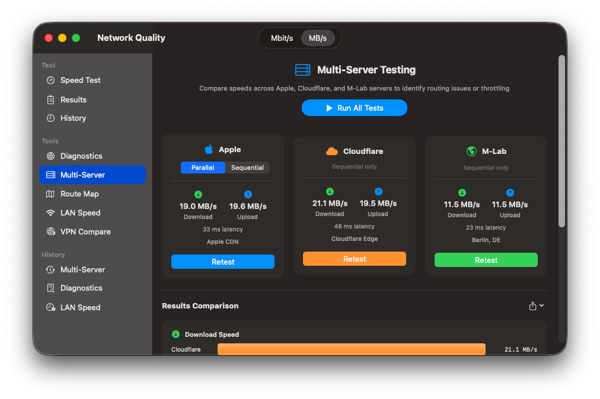
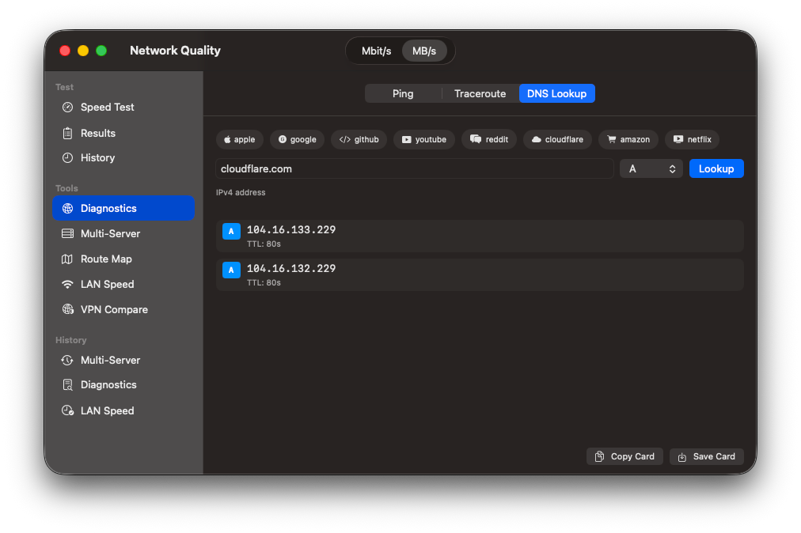
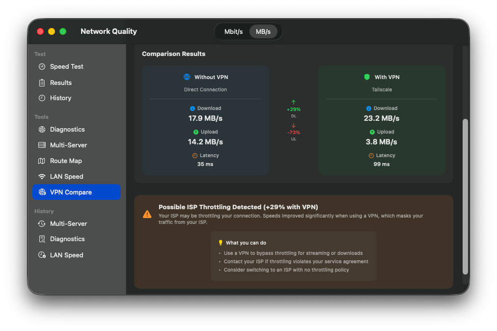
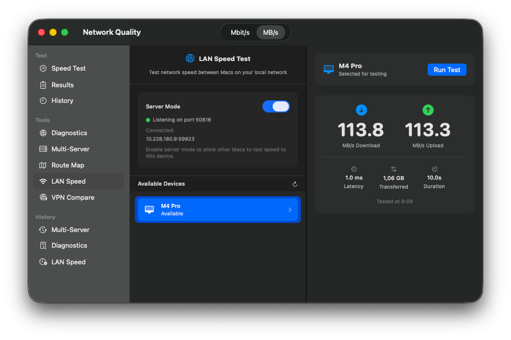
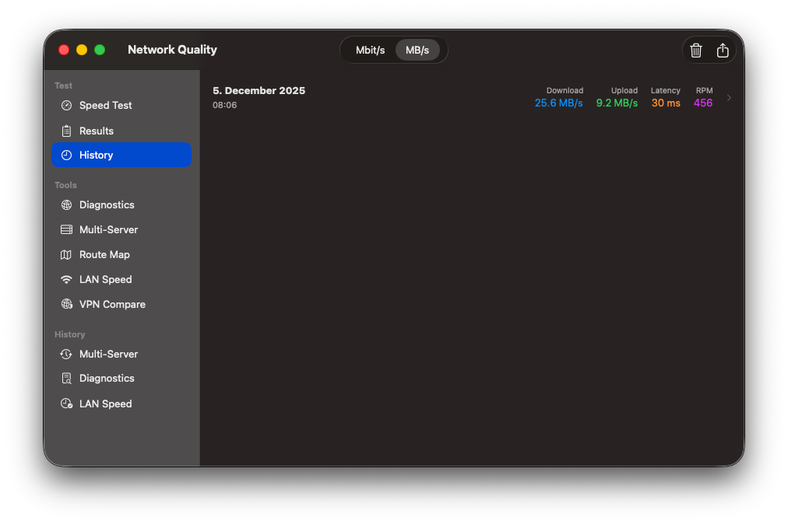

# NetworkQuality

A native macOS application for comprehensive network performance testing and diagnostics.


## Features

### Speed Testing

Run Apple's built-in network quality test with real-time progress, detailed results, and performance insights.

<p align="center">


</p>

### Multi-Server Comparison

Compare results across multiple providers — Apple, Cloudflare, and M-Lab — to get a complete picture of your network performance.

<p align="center">


</p>

### Network Diagnostics

Built-in tools for ping, traceroute, and DNS lookups.

<p align="center">


</p>

### Route Mapping

Visualize your network path with geographic traceroute mapping.

<p align="center">

</p>

### VPN Comparison

Detect potential ISP throttling by comparing speeds with and without VPN.

<p align="center">


</p>

### LAN Speed Test

Measure local network performance between devices on your network.

<p align="center">


</p>

### History & Export

Track results over time. Export to PNG, CSV, JSON, or PDF.

<p align="center">


</p>

## Requirements

- macOS 14.0 or later
- Apple Silicon or Intel Mac

## Installation

1. Download `NetworkQuality-1.0.dmg` from [Releases](../../releases)
2. Open the DMG and drag NetworkQuality to Applications
3. Launch from Applications folder

On first launch, macOS may ask to confirm opening an app from an identified developer.

## Building from Source

```bash
git clone https://github.com/Xpycode/NetworkQuality.git
cd NetworkQuality
open NetworkQuality.xcodeproj
```

Build with Xcode 15 or later.

## How It Works

| Provider | Method | What it measures |
|----------|--------|------------------|
| Apple | `networkQuality` CLI | Responsiveness (RPM), bufferbloat, capacity |
| Cloudflare | HTTPS downloads/uploads | Raw throughput to edge servers |
| M-Lab | WebSocket NDT7 | Research-grade measurement |

Results include download/upload speeds, latency, and where available, responsiveness metrics that indicate real-world performance for interactive applications.

## Privacy

- No accounts or sign-up required
- Test data stays on your device
- Network requests only go to speed test servers (Apple, Cloudflare, M-Lab) and ipinfo.io for geographic lookup
- No analytics or telemetry

## License

MIT License — see [LICENSE](LICENSE) for details.

## Acknowledgments

- [Apple networkQuality](https://support.apple.com/en-us/102336) for the underlying measurement technology
- [Cloudflare Speed Test](https://speed.cloudflare.com) for edge network testing
- [Measurement Lab](https://www.measurementlab.net) for open network measurement infrastructure
- [ipinfo.io](https://ipinfo.io) for IP geolocation
